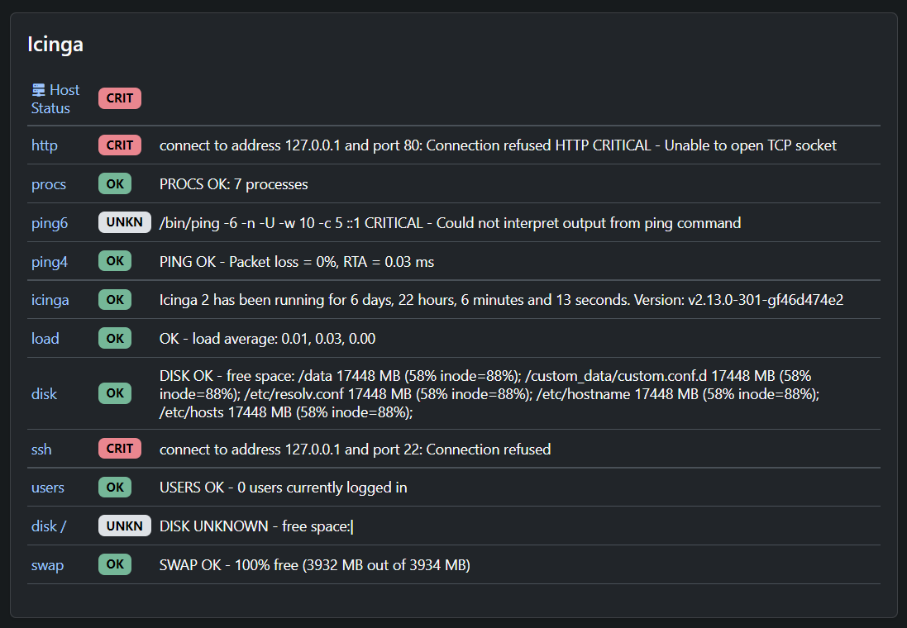

# Nagios Status in NetBox

Plugin to show Nagios host and service status in NetBox on the device page.



## Installation

Add the plugin to your `PLUGINS` list in `configuration.py` and configure at
least the `livestatus_host` and `nagios_base_url` options in `PLUGINS_CONFIG`:

```python
PLUGINS = [
    "netbox_nagios",
]

PLUGINS_CONFIG = {
    "netbox_nagios": {
        "livestatus_host": "nagios.example.com",
        "nagios_base_url": "https://nagios.example.com/nagios/cgi-bin/",
    },
}
```

Optional options are `livestatus_port` (defaults to 6557)
`livestatus_host_overrides` and `nagios_base_url_overrides` (both default to an
empty list) that take tuples of `(regex, override)` to use a different
livestatus host or Nagios URL for a subset of hosts. The regexes are applied in
order, with the first match being used.

Example:

```python
PLUGINS_CONFIG = {
    "netbox_nagios": {
        ...
        "livestatus_host_overrides": [
            (r"^(some|other)host$", "nagios-special.example.com"),
        ],
        "nagios_base_url_overrides": [
            (r"^(some|other)host$", "https://nagios-special.example.com/nagios/cgi-bin/"),
        ],
    },
}
```
